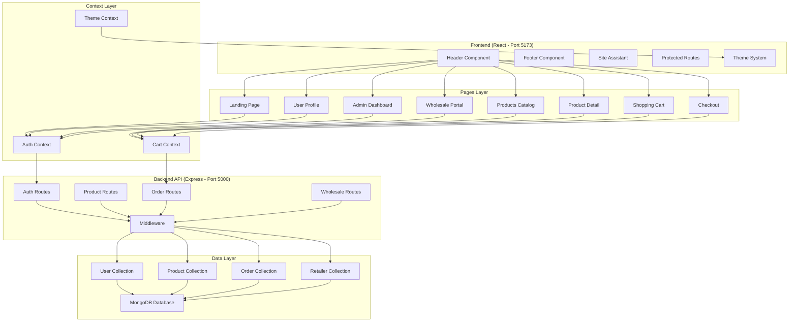
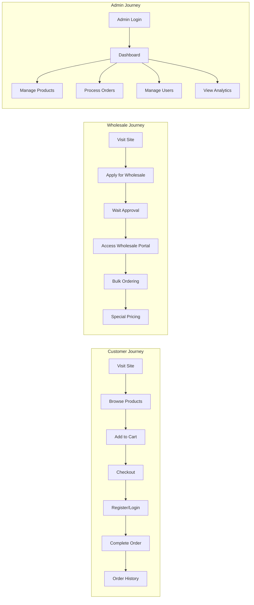
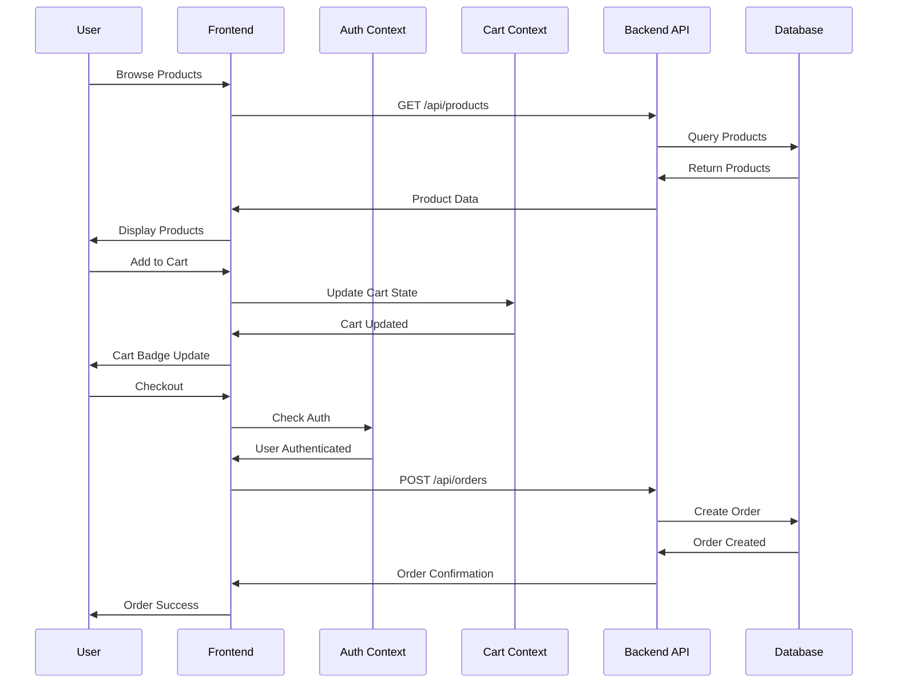
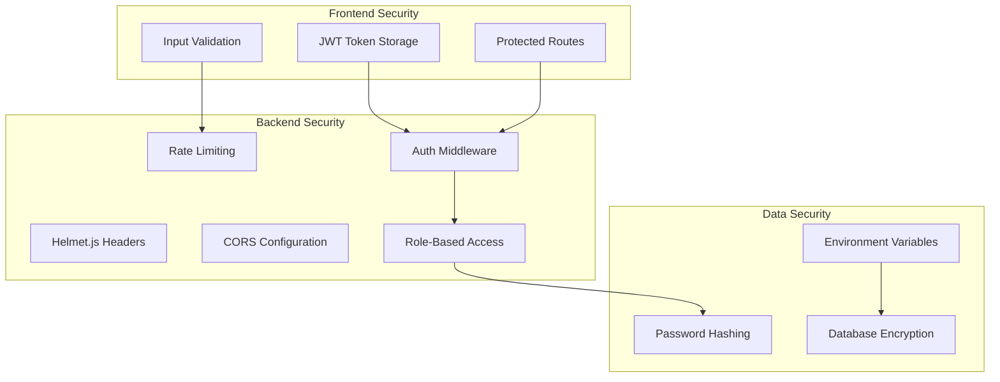

# Muwas System Architecture Map

## Visual System Overview



## User Flow Architecture



## Data Flow Architecture



## Security Architecture



## Component Hierarchy

```
App
├── AuthProvider
│   ├── Header
│   │   ├── Navigation
│   │   ├── UserMenu
│   │   └── ThemeToggle
│   ├── ProtectedRoute
│   │   ├── Profile
│   │   ├── Orders
│   │   ├── Wholesale
│   │   └── AdminDashboard
│   └── SiteAssistant
├── CartProvider
│   ├── Products
│   ├── ProductDetail
│   ├── Cart
│   └── Checkout
├── Router
│   ├── Landing
│   ├── Story
│   ├── Contact
│   ├── Login
│   └── Register
└── Footer
```

## API Architecture

### Request Flow
1. **Frontend Request** → Axios HTTP Client
2. **Authentication Check** → JWT Token Validation
3. **Route Processing** → Express Router
4. **Middleware Chain** → Auth, Validation, Rate Limiting
5. **Controller Logic** → Business Logic Execution
6. **Database Operations** → Mongoose ODM
7. **Response** → Formatted JSON Response

### Error Handling
- Frontend: Try-catch blocks with user-friendly messages
- Backend: Centralized error handling middleware
- Database: Mongoose validation and error handling

## Performance Considerations

### Frontend Optimization
- Code splitting with React.lazy()
- Image optimization and lazy loading
- Tailwind CSS purging for minimal bundle size
- Vite build optimization

### Backend Optimization
- Database indexing for common queries
- Pagination for large datasets
- Caching strategies for frequently accessed data
- Efficient query patterns with Mongoose

### Database Design
- Normalized data structure
- Appropriate indexing strategy
- Relationship management between collections
- Scalable schema design

## Deployment Architecture

### Development Environment
- Frontend: Vite dev server (localhost:5173)
- Backend: Node.js with Nodemon (localhost:5000)
- Database: Local MongoDB instance

### Production Considerations
- Frontend: Static asset hosting (CDN)
- Backend: Containerized deployment
- Database: Managed MongoDB service
- Load balancing and scaling strategies
- Monitoring and logging systems

---

This architecture map provides a comprehensive visual and structural overview of the Muwas distilling system, helping developers understand the relationships between components and data flow throughout the application.
